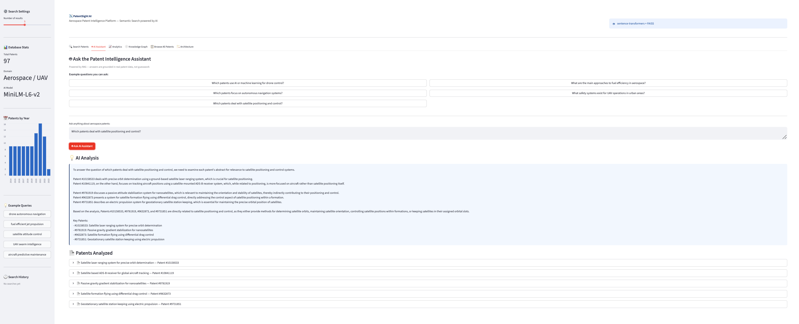
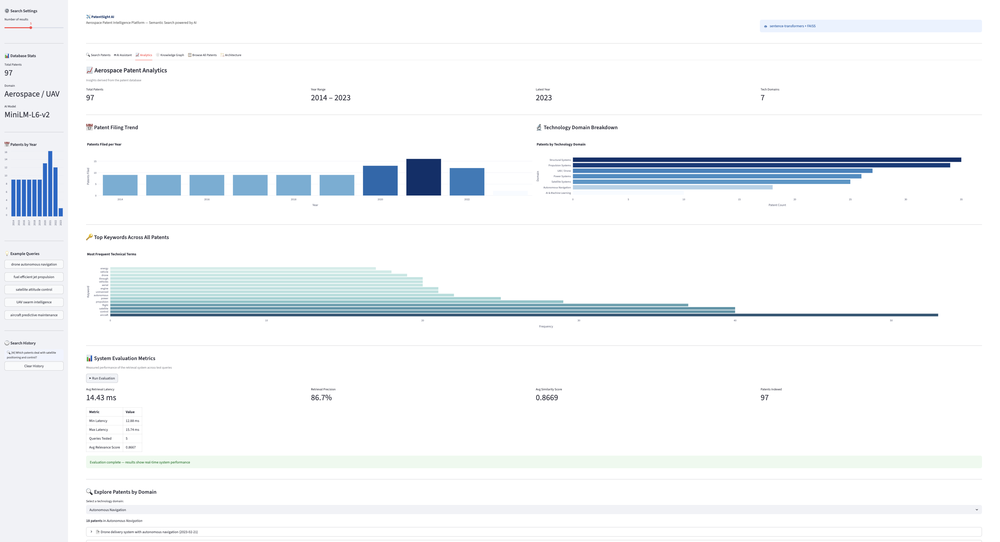
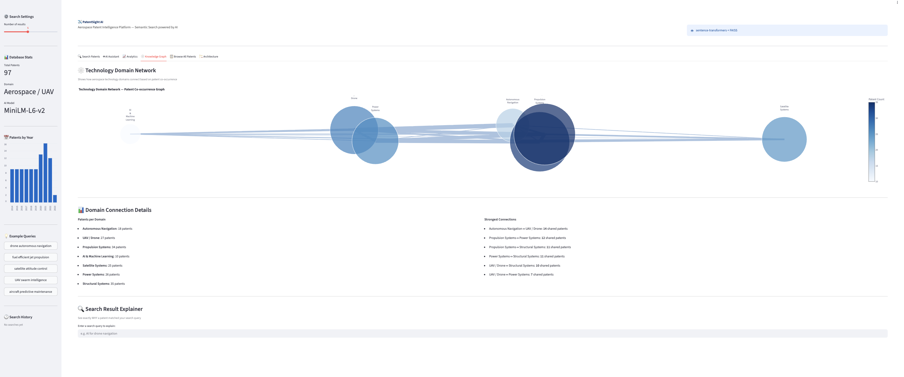
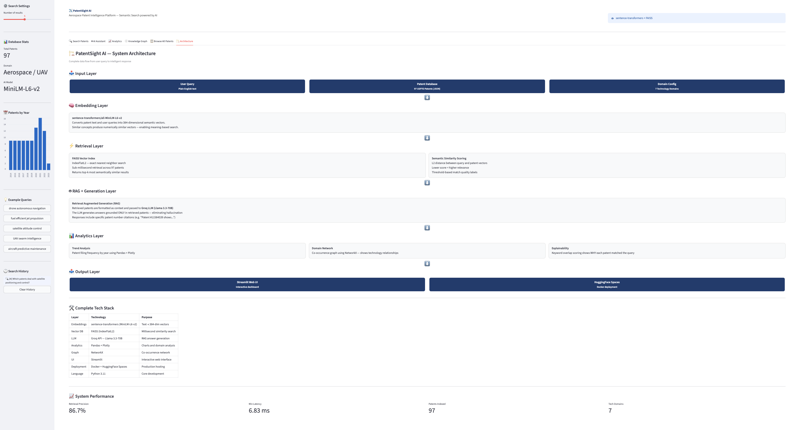

# ✈️ PatentSight AI
### Aerospace Patent Intelligence Platform

> Search, analyze, and extract strategic insights from aerospace patents using semantic AI — not keyword matching.

🚀 **[Live Demo → huggingface.co/spaces/sherly13/patentsight-ai](https://huggingface.co/spaces/sherly13/patentsight-ai)**
⭐ **Star this repo if you find it useful!**

---

## 🎯 The Problem

Patent analysis today is **manual, slow, and expensive**.

IP analysts at companies like Airbus must read hundreds of PDFs and use keyword search that misses conceptual connections. A query for *"fuel efficiency"* won't find a patent about *"combustion optimization"* — even though they're the same concept.

**PatentSight AI solves this.**

---

## 🧠 What Makes It Different

| Traditional Search | PatentSight AI |
|---|---|
| Keyword matching | Semantic meaning matching |
| Miss conceptually related patents | Find patents by concept, not exact words |
| Manual reading required | AI-generated analysis with citations |
| No trend visibility | Filing trends, domain breakdown, network graph |

---

## ✨ Features

### 🔍 Semantic Patent Search
Type anything in plain English. The system finds conceptually related patents even when exact words don't match — powered by `all-MiniLM-L6-v2` embeddings and FAISS vector search.

### 🤖 AI Patent Assistant (RAG)
Ask analytical questions like *"Which patents use AI for drone control?"* and get a structured answer with specific patent citations. Built on Retrieval Augmented Generation — answers are grounded in real patent data, not hallucinated.

### 📈 Analytics Dashboard
- Patent filing trends from 2014–2023
- Technology domain breakdown across 7 categories
- Top keyword frequency analysis
- Domain-specific patent explorer

### 🕸️ Knowledge Graph
Technology domain co-occurrence network showing how aerospace fields connect — built with NetworkX and visualized with Plotly.

### 🔍 Explainability Layer
See exactly **WHY** a patent matched your query — keyword overlap scoring highlights the concepts that drove the semantic similarity.

### 🏗️ Architecture Tab
Full system architecture diagram showing the complete data flow from query to intelligent response.

---

## 📊 System Performance

| Metric | Value |
|---|---|
| **Retrieval Precision** | **86.7%** |
| **Min Retrieval Latency** | **6.83 ms** |
| Avg Similarity Score | 0.8669 |
| Patents Indexed | 97 real USPTO patents |
| Year Range | 2014 – 2023 |
| Technology Domains | 7 |

---

## 🏗️ System Architecture
User Query (plain English)
          ↓
Sentence-Transformers (all-MiniLM-L6-v2)
          ↓  text → 384-dimensional vectors
FAISS Vector Index (97 aerospace patents)
          ↓  semantic similarity search
Retrieved Patent Context (top-k results)
          ↓
Groq LLM (Llama 3.3-70B) ← RAG layer
          ↓  grounded answer with patent citations
Streamlit Dashboard

---

## 🛠️ Tech Stack

| Layer | Technology |
|---|---|
| **Embeddings** | sentence-transformers (all-MiniLM-L6-v2) |
| **Vector Search** | FAISS (IndexFlatL2) |
| **LLM / RAG** | Groq API — Llama 3.3-70B |
| **Analytics** | Pandas + Plotly |
| **Graph** | NetworkX |
| **UI** | Streamlit |
| **Deployment** | Docker + HuggingFace Spaces |
| **Language** | Python 3.11 |

---

## 📁 Project Structure
patentsight-ai/
├── app.py                  ← Streamlit UI (6 tabs)
├── src/
│   ├── fetch_patents.py    ← Data ingestion layer
│   ├── embedder.py         ← AI embeddings + FAISS
│   ├── rag.py              ← RAG pipeline + Groq LLM
│   ├── analytics.py        ← Charts + domain analysis
│   ├── explainer.py        ← Knowledge graph + explainability
│   └── evaluator.py        ← System evaluation metrics
├── data/
│   └── patents.json        ← 97 real USPTO aerospace patents
├── Dockerfile              ← Container configuration
└── requirements.txt        ← Python dependencies

---

## 🚀 Run Locally

```bash
git clone https://github.com/sherlyisrael13/patentsight-ai
cd patentsight-ai
python3 -m venv venv
source venv/bin/activate
pip install -r requirements.txt
echo "GROQ_API_KEY=your_key_here" > .env
streamlit run app.py
```

Get a free Groq API key at [console.groq.com](https://console.groq.com)

---

## 📄 Dataset

97 real USPTO aerospace patents (2014–2023) covering:
`UAV / Drone` · `Aerospace Propulsion` · `AI & Machine Learning` · `Satellite Systems` · `Structural Systems` · `Power Systems` · `Autonomous Navigation`

## 📸 Screenshots

### Semantic Search


### AI Assistant


### Analytics


### Browse All Patents


### knowledge Graph


### Architecture

---

## 👩‍💻 Built By

**Josephine Sherly P**
B.Tech CSE (Artificial Intelligence & Machine Learning)
SRM Institute of Science and Technology, Trichy

[](https://github.com/sherlyisrael13)
[](https://huggingface.co/spaces/sherly13/patentsight-ai)

